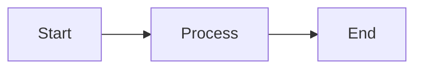

# How to View Mermaid Diagrams in Markdown

## Quick Setup Guide

### ✅ VS Code (Recommended)

1. **Install Extension:**
   - Open VS Code Extensions (Cmd/Ctrl + Shift + X)
   - Search for: `Markdown Preview Mermaid Support`
   - Install by "bierner" or "bierner.markdown-mermaid"

2. **View Diagrams:**
   - Open any `.md` file with diagrams
   - Press `Cmd + Shift + V` (Mac) or `Ctrl + Shift + V` (Windows/Linux)
   - Or right-click → "Open Preview"
   - Diagrams will render automatically!

### ✅ GitHub / GitLab

- Simply push your markdown files to GitHub/GitLab
- View the file online - diagrams render automatically
- No setup needed!

### ✅ Online Viewer

1. Go to [mermaid.live](https://mermaid.live)
2. Copy the Mermaid code from the markdown file (between \`\`\`mermaid and \`\`\`)
3. Paste into the editor
4. View the rendered diagram

### ✅ Obsidian

- Obsidian has built-in Mermaid support
- Just open the markdown file
- Diagrams render automatically in preview mode

### ✅ Typora

- Typora has built-in Mermaid support
- Open the markdown file
- Diagrams render automatically

### ✅ Browser Extensions

**Chrome:**
- Install "Markdown Viewer" extension
- Open markdown files in browser
- Diagrams will render

**Firefox:**
- Install "Markdown Viewer" addon
- Open markdown files
- Diagrams will render

---

## Recommended VS Code Extensions

### Primary Extension (Required)
```
Name: Markdown Preview Mermaid Support
ID: bierner.markdown-mermaid
Publisher: Matt Bierner
```

### Alternative Extension
```
Name: Markdown Preview Enhanced
ID: shd101wyy.markdown-preview-enhanced
Publisher: Yiyi Wang
```

### Installation Command
```bash
# Using VS Code command palette
1. Press Cmd/Ctrl + Shift + P
2. Type: "Extensions: Install Extensions"
3. Search: "Markdown Preview Mermaid Support"
4. Click Install
```

---

## Troubleshooting

### Diagrams Not Showing in VS Code?

1. **Check Extension:**
   - Make sure "Markdown Preview Mermaid Support" is installed and enabled
   - Reload VS Code after installation

2. **Check Syntax:**
   - Ensure code blocks use \`\`\`mermaid (not \`\`\`mermaid or \`\`\`markdown)
   - Check for syntax errors in the Mermaid code

3. **Try Alternative Preview:**
   - Use "Markdown Preview Enhanced" extension instead
   - Or use the online viewer at mermaid.live

### Still Not Working?

1. **Copy to Online Viewer:**
   - Go to https://mermaid.live
   - Copy the Mermaid code block
   - Paste and view

2. **Export as Image:**
   - Use mermaid.live to export diagrams as PNG/SVG
   - Insert images into markdown files

3. **Use Alternative Format:**
   - Check the text-based flow descriptions in the documents
   - Use the summary sections for quick reference

---

## Quick Test

Try this simple diagram to test your setup:



If you can see a diagram with Start → Process → End, your setup is working! ✅

---

## File Locations

The following files contain Mermaid diagrams:

1. **JOB_LIFECYCLE_JOURNEY.md** - Main journey flow diagram
2. **JOB_JOURNEY_DIAGRAMS.md** - Multiple visual diagrams
   - Complete lifecycle flow
   - Role-based swimlanes
   - Decision tree
   - Checkpoint validation flow
   - Timeline view
   - Status transitions

---

## Need Help?

- **Mermaid Documentation:** https://mermaid.js.org/
- **Mermaid Live Editor:** https://mermaid.live
- **VS Code Extension Docs:** Check extension marketplace page

---

**Last Updated:** December 2024


