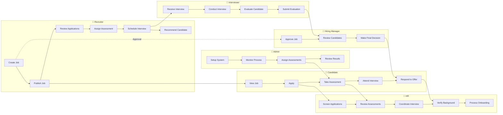
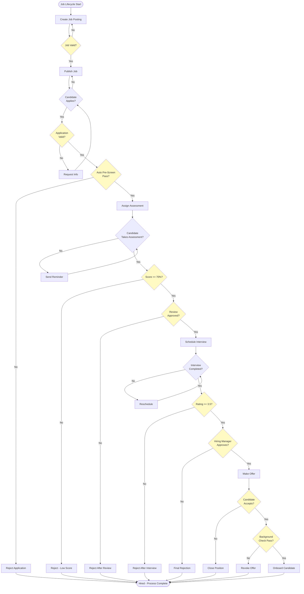
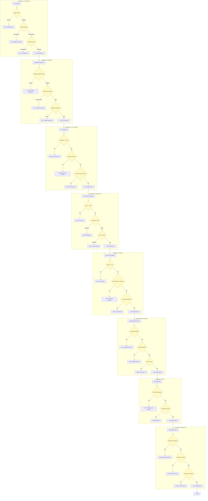
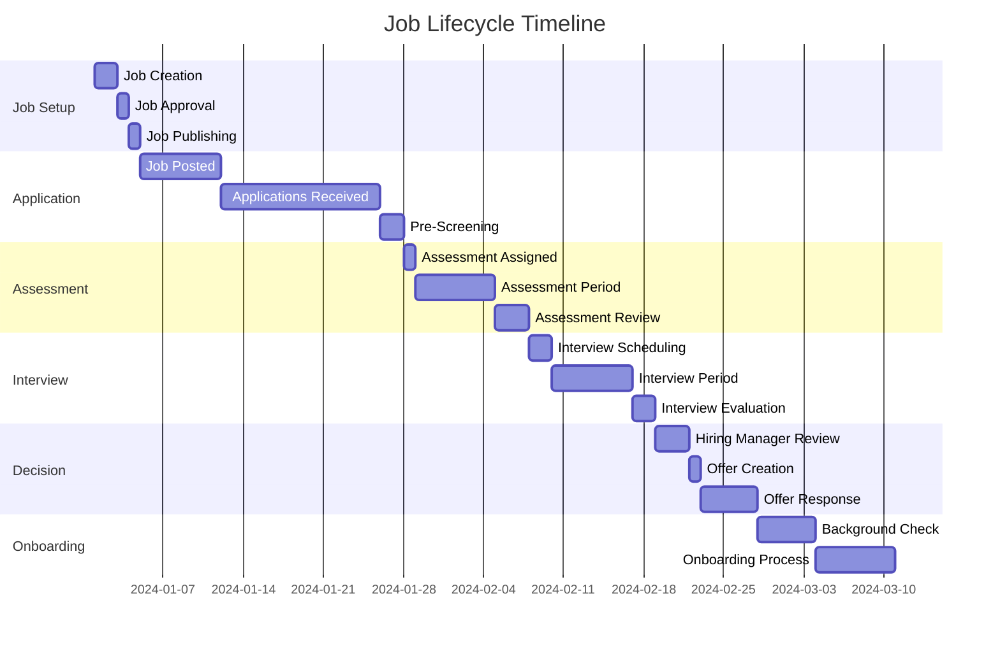
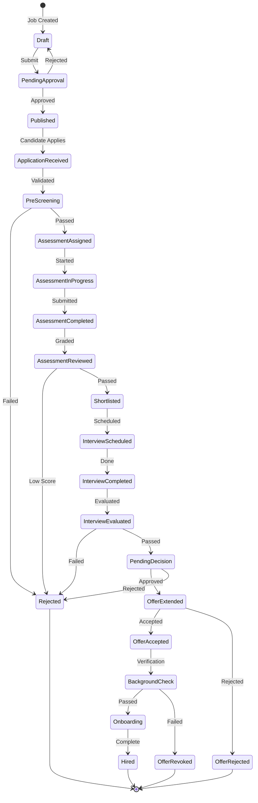

# Job Journey Visual Diagrams

> **📖 How to View These Diagrams:**
> 
> **Option 1: VS Code** - Install the "Markdown Preview Mermaid Support" extension
> - Open Command Palette (Cmd/Ctrl + Shift + P)
> - Type "Markdown: Open Preview"
> - Diagrams will render automatically
> 
> **Option 2: GitHub/GitLab** - Diagrams render automatically when viewing on GitHub/GitLab
> 
> **Option 3: Online Viewer** - Copy Mermaid code and paste at [mermaid.live](https://mermaid.live)
> 
> **Option 4: Browser Extension** - Install "Markdown Viewer" extension for Chrome/Firefox

---

## Complete Job Lifecycle - Swimlane Diagram

This diagram shows how each role interacts throughout the job lifecycle.

```mermaid
graph TB
    subgraph "Phase 1: Job Creation"
        A1[Recruiter/Hiring Manager<br/>Creates Job] --> A2{Job Validation}
        A2 -->|Pass| A3[Hiring Manager<br/>Approves]
        A3 --> A4[Recruiter<br/>Publishes]
        A2 -->|Fail| A1
    end
    
    subgraph "Phase 2: Candidate Discovery"
        B1[Job on Job Board] --> B2[Candidate Views Job]
        B2 --> B3{Candidate Decision}
        B3 -->|Apply| B4[Submit Application]
        B3 -->|Skip| B1
    end
    
    subgraph "Phase 3: Application Processing"
        C1[Application Received] --> C2[Auto Pre-Screening]
        C2 -->|Pass| C3[Recruiter/Admin<br/>Assigns Assessment]
        C2 -->|Fail| C4[Auto-Reject]
        C3 --> C5[System Sends<br/>Assessment Link]
    end
    
    subgraph "Phase 4: Assessment"
        D1[Candidate Takes<br/>Assessment] --> D2[System Auto-Grades]
        D2 --> D3{Score Check}
        D3 -->|>=70%| D4[Recruiter/HR<br/>Reviews]
        D3 -->|<70%| D5[Auto-Reject]
        D4 -->|Approve| D6[Shortlist Candidate]
        D4 -->|Reject| D5
    end
    
    subgraph "Phase 5: Interview"
        E1[Recruiter/HR<br/>Schedules Interview] --> E2[Interviewer<br/>Conducts Interview]
        E2 --> E3[Interviewer<br/>Evaluates]
        E3 --> E4{Evaluation<br/>Check}
        E4 -->|Pass| E5[Send to Hiring<br/>Manager]
        E4 -->|Fail| E6[Reject]
    end
    
    subgraph "Phase 6: Decision"
        F1[Hiring Manager<br/>Reviews All Data] --> F2{Final Decision}
        F2 -->|Approve| F3[HR Makes Offer]
        F2 -->|Reject| F4[Reject Candidate]
        F3 --> F5{Candidate<br/>Response}
        F5 -->|Accept| F6[Background Check]
        F5 -->|Reject| F7[Close Position]
    end
    
    subgraph "Phase 7: Onboarding"
        G1[Background Check] --> G2{Background<br/>Pass?}
        G2 -->|Pass| G3[HR/Admin<br/>Onboarding]
        G2 -->|Fail| G4[Revoke Offer]
        G3 --> G5[Hired]
    end
    
    A4 --> B1
    B4 --> C1
    C5 --> D1
    D6 --> E1
    E5 --> F1
    F6 --> G1
    
    style A2 fill:#fff9c4
    style C2 fill:#fff9c4
    style D3 fill:#fff9c4
    style E4 fill:#fff9c4
    style F2 fill:#fff9c4
    style F5 fill:#fff9c4
    style G2 fill:#fff9c4
```

---

## Role-Based Swimlane Diagram

---

## Decision Tree - Complete Flow

---

## Checkpoint Validation Flow

---

## Timeline View - Job Lifecycle

---

## Status Transition Diagram

---

## Role Interaction Matrix

| Phase | Admin | Recruiter | HR | Interviewer | Hiring Manager | Candidate |
|-------|:-----:|:---------:|:--:|:-----------:|:--------------:|:---------:|
| **1. Job Creation** | Setup | Create | - | - | Approve | - |
| **2. Job Posting** | Publish | Manage | - | - | - | View |
| **3. Application** | Monitor | Review | Screen | - | - | Submit |
| **4. Assessment** | Assign | Assign | Review | - | - | Take |
| **5. Interview** | Schedule | Schedule | Coordinate | Conduct | - | Attend |
| **6. Decision** | Support | Recommend | Verify | Evaluate | Decide | Respond |
| **7. Onboarding** | Setup | - | Process | - | Welcome | Complete |

---

## Key Validation Rules

### **Checkpoint 1: Job Creation**
- ✅ All required fields present
- ✅ Job description length >= 100 characters
- ✅ Required skills defined (min 3)
- ✅ Budget within approved limits
- ✅ Hiring Manager approval received

### **Checkpoint 2: Application**
- ✅ Email format valid
- ✅ Phone format valid (if provided)
- ✅ Resume uploaded (PDF/DOC, max 5MB)
- ✅ All pre-screening questions answered
- ✅ No duplicate application

### **Checkpoint 3: Pre-Screening**
- ✅ Skill match >= 60%
- ✅ Experience level matches minimum
- ✅ Location compatible (if required)
- ✅ Pre-screening answers meet criteria

### **Checkpoint 4: Assessment**
- ✅ Assessment completed within time limit
- ✅ Score >= 70%
- ✅ No plagiarism detected
- ✅ All questions attempted
- ✅ Code compiles and runs

### **Checkpoint 5: Interview**
- ✅ Interview conducted
- ✅ Evaluation form completed
- ✅ Overall rating >= 3.5/5
- ✅ All required fields filled
- ✅ Consensus reached (if multiple interviewers)

### **Checkpoint 6: Final Decision**
- ✅ All candidate data reviewed
- ✅ Budget available
- ✅ Team fit assessed
- ✅ Hiring Manager approval

### **Checkpoint 7: Offer**
- ✅ Offer within budget
- ✅ All terms defined
- ✅ Legal compliance verified
- ✅ Candidate accepts offer

### **Checkpoint 8: Background Check**
- ✅ Employment history verified
- ✅ Education verified
- ✅ References checked
- ✅ No red flags found

---

**Last Updated:** December 2024  
**Version:** 1.0

