# Job Journey Visual Diagrams

> **📖 How to View These Diagrams:**
> 
> **Option 1: VS Code** - Install the "Markdown Preview Mermaid Support" extension
> - Open Command Palette (Cmd/Ctrl + Shift + P)
> - Type "Markdown: Open Preview"
> - Diagrams will render automatically
> 
> **Option 2: GitHub/GitLab** - Diagrams render automatically when viewing on GitHub/GitLab
> 
> **Option 3: Online Viewer** - Copy Mermaid code and paste at [mermaid.live](https://mermaid.live)
> 
> **Option 4: Browser Extension** - Install "Markdown Viewer" extension for Chrome/Firefox

---

## Complete Job Lifecycle - Swimlane Diagram

This diagram shows how each role interacts throughout the job lifecycle.

---

## Role-Based Swimlane Diagram

---

## Decision Tree - Complete Flow

---

## Checkpoint Validation Flow

```mermaid
graph TB
    subgraph "Checkpoint 1: Job Creation"
        CP1[Job Created] --> V1{Validate Fields}
        V1 -->|Missing| E1[Error: Missing Fields]
        V1 -->|Complete| V2{Validate Budget}
        V2 -->|Over Budget| E2[Error: Budget Exceeded]
        V2 -->|Within Budget| V3{Validate Approval}
        V3 -->|Not Approved| E3[Error: Not Approved]
        V3 -->|Approved| P1[✅ Pass Checkpoint 1]
    end
    
    subgraph "Checkpoint 2: Application"
        CP2[Application Submitted] --> V4{Validate Required Fields}
        V4 -->|Missing| E4[Error: Incomplete Application]
        V4 -->|Complete| V5{Validate File Uploads}
        V5 -->|Invalid Format| E5[Error: Invalid File Format]
        V5 -->|Valid| V6{Validate Email/Phone}
        V6 -->|Invalid| E6[Error: Invalid Contact Info]
        V6 -->|Valid| P2[✅ Pass Checkpoint 2]
    end
    
    subgraph "Checkpoint 3: Pre-Screening"
        CP3[Pre-Screening] --> V7{Skill Match >= 60%?}
        V7 -->|No| E7[❌ Fail: Low Skill Match]
        V7 -->|Yes| V8{Experience Match?}
        V8 -->|No| E8[❌ Fail: Experience Mismatch]
        V8 -->|Yes| V9{Pre-Screen Answers OK?}
        V9 -->|No| E9[❌ Fail: Poor Answers]
        V9 -->|Yes| P3[✅ Pass Checkpoint 3]
    end
    
    subgraph "Checkpoint 4: Assessment"
        CP4[Assessment Submitted] --> V10{Score >= 70%?}
        V10 -->|No| E10[❌ Fail: Low Score]
        V10 -->|Yes| V11{Plagiarism Check}
        V11 -->|Detected| E11[❌ Fail: Plagiarism]
        V11 -->|Clean| V12{Time Limit OK?}
        V12 -->|Exceeded| E12[❌ Fail: Time Exceeded]
        V12 -->|OK| P4[✅ Pass Checkpoint 4]
    end
    
    subgraph "Checkpoint 5: Interview"
        CP5[Interview Completed] --> V13{Rating >= 3.5?}
        V13 -->|No| E13[❌ Fail: Low Rating]
        V13 -->|Yes| V14{All Evaluations Complete?}
        V14 -->|No| E14[Error: Incomplete Evaluation]
        V14 -->|Yes| V15{Consensus Reached?}
        V15 -->|No| E15[Error: No Consensus]
        V15 -->|Yes| P5[✅ Pass Checkpoint 5]
    end
    
    subgraph "Checkpoint 6: Final Decision"
        CP6[Hiring Manager Review] --> V16{All Data Reviewed?}
        V16 -->|No| E16[Error: Incomplete Review]
        V16 -->|Yes| V17{Budget Available?}
        V17 -->|No| E17[Error: Budget Exceeded]
        V17 -->|Yes| V18{Team Fit OK?}
        V18 -->|No| E18[❌ Fail: Poor Team Fit]
        V18 -->|Yes| P6[✅ Pass Checkpoint 6]
    end
    
    subgraph "Checkpoint 7: Offer"
        CP7[Offer Extended] --> V19{Offer Within Budget?}
        V19 -->|No| E19[Error: Offer Exceeds Budget]
        V19 -->|Yes| V20{Candidate Accepts?}
        V20 -->|No| E20[❌ Offer Rejected]
        V20 -->|Yes| P7[✅ Pass Checkpoint 7]
    end
    
    subgraph "Checkpoint 8: Background"
        CP8[Background Check] --> V21{Employment Verified?}
        V21 -->|No| E21[❌ Fail: Employment Issue]
        V21 -->|Yes| V22{Education Verified?}
        V22 -->|No| E22[❌ Fail: Education Issue]
        V22 -->|Yes| V23{References Positive?}
        V23 -->|No| E23[❌ Fail: Poor References]
        V23 -->|Yes| P8[✅ Pass Checkpoint 8]
    end
    
    P1 --> CP2
    P2 --> CP3
    P3 --> CP4
    P4 --> CP5
    P5 --> CP6
    P6 --> CP7
    P7 --> CP8
    P8 --> Success[🎉 Hired]
    
    style V1 fill:#fff9c4
    style V2 fill:#fff9c4
    style V3 fill:#fff9c4
    style V4 fill:#fff9c4
    style V5 fill:#fff9c4
    style V6 fill:#fff9c4
    style V7 fill:#fff9c4
    style V8 fill:#fff9c4
    style V9 fill:#fff9c4
    style V10 fill:#fff9c4
    style V11 fill:#fff9c4
    style V12 fill:#fff9c4
    style V13 fill:#fff9c4
    style V14 fill:#fff9c4
    style V15 fill:#fff9c4
    style V16 fill:#fff9c4
    style V17 fill:#fff9c4
    style V18 fill:#fff9c4
    style V19 fill:#fff9c4
    style V20 fill:#fff9c4
    style V21 fill:#fff9c4
    style V22 fill:#fff9c4
    style V23 fill:#fff9c4
```

---

## Timeline View - Job Lifecycle

---

## Status Transition Diagram

---

## Role Interaction Matrix

| Phase | Admin | Recruiter | HR | Interviewer | Hiring Manager | Candidate |
|-------|:-----:|:---------:|:--:|:-----------:|:--------------:|:---------:|
| **1. Job Creation** | Setup | Create | - | - | Approve | - |
| **2. Job Posting** | Publish | Manage | - | - | - | View |
| **3. Application** | Monitor | Review | Screen | - | - | Submit |
| **4. Assessment** | Assign | Assign | Review | - | - | Take |
| **5. Interview** | Schedule | Schedule | Coordinate | Conduct | - | Attend |
| **6. Decision** | Support | Recommend | Verify | Evaluate | Decide | Respond |
| **7. Onboarding** | Setup | - | Process | - | Welcome | Complete |

---

## Key Validation Rules

### **Checkpoint 1: Job Creation**
- ✅ All required fields present
- ✅ Job description length >= 100 characters
- ✅ Required skills defined (min 3)
- ✅ Budget within approved limits
- ✅ Hiring Manager approval received

### **Checkpoint 2: Application**
- ✅ Email format valid
- ✅ Phone format valid (if provided)
- ✅ Resume uploaded (PDF/DOC, max 5MB)
- ✅ All pre-screening questions answered
- ✅ No duplicate application

### **Checkpoint 3: Pre-Screening**
- ✅ Skill match >= 60%
- ✅ Experience level matches minimum
- ✅ Location compatible (if required)
- ✅ Pre-screening answers meet criteria

### **Checkpoint 4: Assessment**
- ✅ Assessment completed within time limit
- ✅ Score >= 70%
- ✅ No plagiarism detected
- ✅ All questions attempted
- ✅ Code compiles and runs

### **Checkpoint 5: Interview**
- ✅ Interview conducted
- ✅ Evaluation form completed
- ✅ Overall rating >= 3.5/5
- ✅ All required fields filled
- ✅ Consensus reached (if multiple interviewers)

### **Checkpoint 6: Final Decision**
- ✅ All candidate data reviewed
- ✅ Budget available
- ✅ Team fit assessed
- ✅ Hiring Manager approval

### **Checkpoint 7: Offer**
- ✅ Offer within budget
- ✅ All terms defined
- ✅ Legal compliance verified
- ✅ Candidate accepts offer

### **Checkpoint 8: Background Check**
- ✅ Employment history verified
- ✅ Education verified
- ✅ References checked
- ✅ No red flags found

---

**Last Updated:** December 2024  
**Version:** 1.0

