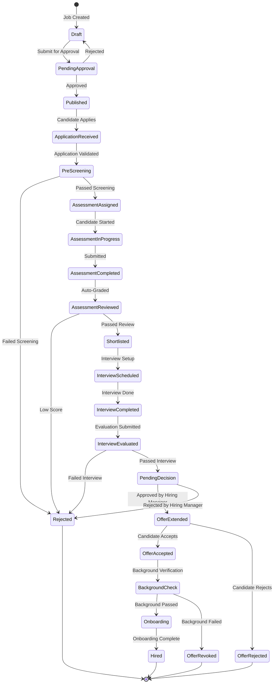

# Job Lifecycle Journey - Complete Business Process Flow

> **📖 How to View Diagrams:**
> 
> **VS Code Users:** Install "Markdown Preview Mermaid Support" extension, then press `Cmd/Ctrl + Shift + V` to open preview
> 
> **GitHub/GitLab:** Diagrams render automatically when viewing online
> 
> **Online Viewer:** Copy Mermaid code blocks to [mermaid.live](https://mermaid.live) to view
> 
> **Alternative:** Use any markdown viewer that supports Mermaid (Obsidian, Typora, etc.)

---

## Overview

This document outlines the complete business journey of a job posting from creation to candidate hiring, showing how all roles (Admin, Recruiter, HR, Interviewer, Hiring Manager, and Candidate) interact throughout the process.

---

## 🎯 Complete Job Lifecycle Journey

### Phase 1: Job Creation & Setup
**Actors:** Admin, Recruiter, Hiring Manager

### Phase 2: Job Posting & Candidate Discovery
**Actors:** Recruiter, Candidate

### Phase 3: Application & Assessment
**Actors:** Candidate, Admin, Recruiter

### Phase 4: Evaluation & Interview
**Actors:** Interviewer, HR, Recruiter

### Phase 5: Decision & Onboarding
**Actors:** Hiring Manager, HR, Admin

---

## 📊 Complete Journey Flow Diagram

```mermaid
graph TB
    Start([Job Requisition Created]) --> CreateJob[Recruiter/Hiring Manager<br/>Creates Job Posting]
    
    CreateJob --> ValidateJob{Job Validation<br/>Checkpoint}
    ValidateJob -->|Invalid| RejectJob[Reject Job<br/>Return for Revision]
    RejectJob --> CreateJob
    ValidateJob -->|Valid| ApproveJob[Hiring Manager<br/>Approves Job]
    
    ApproveJob --> PublishJob[Recruiter<br/>Publishes Job]
    PublishJob --> JobBoard[Job Appears on<br/>Job Board]
    
    JobBoard --> CandidateViews[Candidate<br/>Views Job Details]
    CandidateViews --> ApplyDecision{Decision to<br/>Apply?}
    ApplyDecision -->|No| BrowseMore[Browse Other Jobs]
    BrowseMore --> JobBoard
    
    ApplyDecision -->|Yes| SubmitApplication[Candidate<br/>Submits Application]
    SubmitApplication --> ApplicationValidation{Application<br/>Validation}
    ApplicationValidation -->|Incomplete| RequestInfo[Request Additional<br/>Information]
    RequestInfo --> SubmitApplication
    ApplicationValidation -->|Complete| ApplicationReceived[Application<br/>Received]
    
    ApplicationReceived --> AutoScreening{Auto Pre-Screening<br/>Checkpoint}
    AutoScreening -->|Failed| RejectAuto[Auto-Reject<br/>Application]
    AutoScreening -->|Passed| AssignAssessment[Recruiter/Admin<br/>Assigns Assessment]
    
    AssignAssessment --> SendAssessmentLink[System Sends<br/>Assessment Link]
    SendAssessmentLink --> CandidateTakes[Candidate<br/>Takes Assessment]
    
    CandidateTakes --> AssessmentValidation{Assessment<br/>Validation}
    AssessmentValidation -->|Time Expired| AutoSubmit[Auto-Submit<br/>Assessment]
    AssessmentValidation -->|Completed| SubmitAssessment[Candidate<br/>Submits Assessment]
    AutoSubmit --> SubmitAssessment
    
    SubmitAssessment --> AutoGrade[System Auto-Grades<br/>Assessment]
    AutoGrade --> ScoreCheck{Score<br/>Checkpoint}
    ScoreCheck -->|Below Threshold| RejectAssessment[Reject - Low Score]
    ScoreCheck -->|Meets Threshold| ReviewAssessment[Recruiter/HR<br/>Reviews Assessment]
    
    ReviewAssessment --> AssessmentReviewCheck{Assessment<br/>Review Checkpoint}
    AssessmentReviewCheck -->|Reject| RejectAfterReview[Reject After<br/>Review]
    AssessmentReviewCheck -->|Approve| ShortlistCandidate[Shortlist<br/>Candidate]
    
    ShortlistCandidate --> ScheduleInterview[Recruiter/HR<br/>Schedules Interview]
    ScheduleInterview --> NotifyInterviewer[Notify Interviewer<br/>of Interview]
    NotifyInterviewer --> NotifyCandidate[Notify Candidate<br/>of Interview]
    
    NotifyCandidate --> InterviewConducted[Interviewer<br/>Conducts Interview]
    InterviewConducted --> InterviewEvaluation[Interviewer<br/>Evaluates Candidate]
    
    InterviewEvaluation --> InterviewCheckpoint{Interview<br/>Checkpoint}
    InterviewCheckpoint -->|Reject| RejectInterview[Reject After<br/>Interview]
    InterviewCheckpoint -->|Approve| SendToHiringManager[Send to Hiring<br/>Manager for Decision]
    
    SendToHiringManager --> HiringManagerReview[Hiring Manager<br/>Reviews All Data]
    HiringManagerReview --> FinalDecision{Final<br/>Decision}
    
    FinalDecision -->|Reject| RejectFinal[Final Rejection<br/>Notify Candidate]
    FinalDecision -->|Approve| MakeOffer[HR Makes<br/>Job Offer]
    
    MakeOffer --> OfferCheckpoint{Offer<br/>Checkpoint}
    OfferCheckpoint -->|Candidate Rejects| OfferRejected[Offer Rejected<br/>Close Position]
    OfferCheckpoint -->|Candidate Accepts| OfferAccepted[Offer Accepted]
    
    OfferAccepted --> BackgroundCheck[HR Conducts<br/>Background Check]
    BackgroundCheck --> BackgroundCheckpoint{Background<br/>Check Checkpoint}
    BackgroundCheckpoint -->|Failed| RevokeOffer[Revoke Offer]
    BackgroundCheckpoint -->|Passed| Onboarding[Start Onboarding<br/>Process]
    
    Onboarding --> Complete[Job Lifecycle<br/>Complete]
    
    style Start fill:#e1f5ff
    style Complete fill:#c8e6c9
    style ValidateJob fill:#fff9c4
    style ApplicationValidation fill:#fff9c4
    style AutoScreening fill:#fff9c4
    style AssessmentValidation fill:#fff9c4
    style ScoreCheck fill:#fff9c4
    style AssessmentReviewCheck fill:#fff9c4
    style InterviewCheckpoint fill:#fff9c4
    style FinalDecision fill:#fff9c4
    style OfferCheckpoint fill:#fff9c4
    style BackgroundCheckpoint fill:#fff9c4
```

---

## 🔍 Detailed Phase Breakdown

### **Phase 1: Job Creation & Setup**

#### Step 1.1: Job Requisition
- **Actor:** Hiring Manager or Department Head
- **Action:** Identifies need for new position
- **Checkpoint:** Budget approval, headcount approval

#### Step 1.2: Job Posting Creation
- **Actor:** Recruiter or Hiring Manager
- **Action:** Creates job posting with:
  - Job title, description, requirements
  - Required skills and experience
  - Salary range, location
  - Application deadline
- **Validation Checkpoint:**
  - ✅ All required fields filled
  - ✅ Job description meets standards
  - ✅ Skills and requirements defined
  - ✅ Salary range within budget

#### Step 1.3: Job Approval
- **Actor:** Hiring Manager
- **Action:** Reviews and approves job posting
- **Validation Checkpoint:**
  - ✅ Job aligns with department needs
  - ✅ Budget approved
  - ✅ Requirements are realistic

#### Step 1.4: Job Publishing
- **Actor:** Recruiter or Admin
- **Action:** Publishes job to job board
- **Validation Checkpoint:**
  - ✅ Job is approved
  - ✅ All information is accurate
  - ✅ Job is visible to candidates

---

### **Phase 2: Job Posting & Candidate Discovery**

#### Step 2.1: Job Visibility
- **Actor:** System
- **Action:** Job appears on public job board
- **Checkpoint:** Job is searchable and visible

#### Step 2.2: Candidate Views Job
- **Actor:** Candidate
- **Action:** Browses job board, views job details
- **Checkpoint:** Candidate has access to job board

#### Step 2.3: Application Decision
- **Actor:** Candidate
- **Action:** Decides whether to apply
- **Checkpoint:** Candidate meets basic requirements

---

### **Phase 3: Application & Assessment**

#### Step 3.1: Application Submission
- **Actor:** Candidate
- **Action:** Fills out application form:
  - Personal information
  - Resume upload
  - Cover letter (optional)
  - Pre-screening questions
  - LinkedIn/GitHub profiles
- **Validation Checkpoints:**
  - ✅ All required fields completed
  - ✅ Resume uploaded (PDF/DOC format)
  - ✅ Email format valid
  - ✅ Phone number format valid
  - ✅ Pre-screening questions answered

#### Step 3.2: Application Received
- **Actor:** System
- **Action:** Application stored in database
- **Checkpoint:** Application ID generated, confirmation sent

#### Step 3.3: Auto Pre-Screening
- **Actor:** System
- **Action:** Automated screening based on:
  - Required skills match
  - Experience level match
  - Location compatibility
  - Pre-screening question answers
- **Validation Checkpoints:**
  - ✅ Minimum skill match threshold (e.g., 60%)
  - ✅ Experience level meets minimum
  - ✅ Pre-screening answers acceptable
  - **Decision:** Pass → Continue | Fail → Auto-Reject

#### Step 3.4: Assessment Assignment
- **Actor:** Recruiter or Admin
- **Action:** Assigns coding assessment to candidate
- **Validation Checkpoints:**
  - ✅ Candidate passed pre-screening
  - ✅ Assessment template selected
  - ✅ Assessment link generated
  - ✅ Candidate email valid

#### Step 3.5: Assessment Link Sent
- **Actor:** System
- **Action:** Sends assessment link via email
- **Checkpoint:** Email delivered successfully

#### Step 3.6: Candidate Takes Assessment
- **Actor:** Candidate
- **Action:** 
  - Accesses assessment link
  - Reviews instructions
  - Starts coding assessment
  - Submits code solutions
- **Validation Checkpoints:**
  - ✅ Assessment link is valid
  - ✅ Assessment not expired
  - ✅ Candidate hasn't already taken it
  - ✅ Time limit enforced
  - ✅ Tab switching detected and logged
  - ✅ Code submitted before deadline

#### Step 3.7: Assessment Auto-Grading
- **Actor:** System
- **Action:** 
  - Runs test cases against submitted code
  - Calculates score based on:
    - Test case pass rate
    - Code quality metrics
    - Time taken
    - Code complexity
- **Validation Checkpoints:**
  - ✅ All test cases executed
  - ✅ Score calculated accurately
  - ✅ Plagiarism check completed
  - ✅ Code quality metrics generated

#### Step 3.8: Score Evaluation
- **Actor:** System
- **Action:** Compares score against threshold
- **Validation Checkpoint:**
  - **Score >= 70%** → Pass to review
  - **Score < 70%** → Auto-reject
  - **Plagiarism detected** → Flag for review

#### Step 3.9: Assessment Review
- **Actor:** Recruiter or HR
- **Action:** Reviews assessment results:
  - Code quality
  - Problem-solving approach
  - Test case results
  - Plagiarism flags
- **Validation Checkpoints:**
  - ✅ Code is original
  - ✅ Solution approach is sound
  - ✅ Code quality is acceptable
  - **Decision:** Approve → Shortlist | Reject → Decline

---

### **Phase 4: Evaluation & Interview**

#### Step 4.1: Candidate Shortlisting
- **Actor:** Recruiter or HR
- **Action:** Adds candidate to shortlist
- **Checkpoint:** Candidate status updated to "Shortlisted"

#### Step 4.2: Interview Scheduling
- **Actor:** Recruiter or HR
- **Action:** 
  - Checks interviewer availability
  - Schedules interview slot
  - Sends calendar invites
- **Validation Checkpoints:**
  - ✅ Interviewer is available
  - ✅ Candidate is available
  - ✅ Meeting room/video link prepared
  - ✅ Interview type selected (Technical/HR/Final)

#### Step 4.3: Interview Notification
- **Actor:** System
- **Action:** Sends notifications to:
  - Interviewer (with candidate details)
  - Candidate (with interview details)
- **Checkpoint:** All parties notified

#### Step 4.4: Interview Conducted
- **Actor:** Interviewer
- **Action:** 
  - Conducts technical/behavioral interview
  - Asks questions
  - Evaluates responses
  - May include live coding session
- **Validation Checkpoints:**
  - ✅ Interview started on time
  - ✅ All required topics covered
  - ✅ Candidate responses documented

#### Step 4.5: Interview Evaluation
- **Actor:** Interviewer
- **Action:** 
  - Fills evaluation form
  - Rates candidate on:
    - Technical skills
    - Problem-solving ability
    - Communication skills
    - Cultural fit
    - Overall recommendation
- **Validation Checkpoints:**
  - ✅ All evaluation fields completed
  - ✅ Ratings provided (1-5 scale)
  - ✅ Comments/feedback added
  - ✅ Recommendation made (Approve/Reject/Hold)

#### Step 4.6: Interview Decision Checkpoint
- **Actor:** System/Recruiter
- **Action:** Reviews interview evaluation
- **Validation Checkpoint:**
  - **Overall Rating >= 3.5** → Send to Hiring Manager
  - **Overall Rating < 3.5** → Reject
  - **Multiple Interviewers** → Consensus required

---

### **Phase 5: Decision & Onboarding**

#### Step 5.1: Hiring Manager Review
- **Actor:** Hiring Manager
- **Action:** Reviews complete candidate profile:
  - Application details
  - Assessment results
  - Interview evaluations
  - All feedback and notes
- **Validation Checkpoints:**
  - ✅ All information reviewed
  - ✅ Team fit considered
  - ✅ Budget alignment verified

#### Step 5.2: Final Decision
- **Actor:** Hiring Manager
- **Action:** Makes hiring decision
- **Validation Checkpoint:**
  - **Approve** → Proceed to offer
  - **Reject** → Send rejection notice
  - **Hold** → Keep in pipeline

#### Step 5.3: Job Offer Creation
- **Actor:** HR
- **Action:** 
  - Creates job offer letter
  - Defines compensation package
  - Sets start date
  - Includes benefits details
- **Validation Checkpoints:**
  - ✅ Offer within budget
  - ✅ All terms clearly defined
  - ✅ Legal compliance verified

#### Step 5.4: Offer Sent
- **Actor:** HR
- **Action:** Sends offer to candidate
- **Checkpoint:** Offer delivered, candidate notified

#### Step 5.5: Offer Response
- **Actor:** Candidate
- **Action:** Reviews and responds to offer
- **Validation Checkpoint:**
  - **Accept** → Proceed to background check
  - **Reject** → Close position or find alternative
  - **Negotiate** → HR handles negotiation

#### Step 5.6: Background Check
- **Actor:** HR
- **Action:** Conducts background verification:
  - Employment history
  - Education verification
  - Reference checks
  - Criminal record check (if required)
- **Validation Checkpoints:**
  - ✅ All verifications completed
  - ✅ No red flags found
  - ✅ References positive
  - **Pass** → Proceed to onboarding
  - **Fail** → Revoke offer

#### Step 5.7: Onboarding Process
- **Actor:** HR and Admin
- **Action:** 
  - Creates employee account
  - Sets up system access
  - Schedules orientation
  - Prepares workspace
- **Validation Checkpoints:**
  - ✅ Account created with correct role
  - ✅ All access permissions set
  - ✅ Onboarding checklist completed

#### Step 5.8: Job Lifecycle Complete
- **Actor:** System
- **Action:** Job posting marked as "Filled"
- **Checkpoint:** All processes completed, candidate hired

---

## 🎯 Role Responsibilities Matrix

| Phase | Admin | Recruiter | HR | Interviewer | Hiring Manager | Candidate |
|-------|-------|-----------|----|-----------|----------------|-----------|
| **Job Creation** | ✅ Setup | ✅ Create | ✅ Review | - | ✅ Approve | - |
| **Job Posting** | ✅ Publish | ✅ Manage | - | - | - | ✅ View |
| **Application** | ✅ Monitor | ✅ Review | ✅ Screen | - | - | ✅ Submit |
| **Assessment** | ✅ Assign | ✅ Assign | ✅ Review | - | - | ✅ Take |
| **Interview** | ✅ Schedule | ✅ Schedule | ✅ Coordinate | ✅ Conduct | - | ✅ Attend |
| **Decision** | ✅ Support | ✅ Recommend | ✅ Verify | ✅ Evaluate | ✅ Decide | ✅ Respond |
| **Onboarding** | ✅ Setup | - | ✅ Process | - | ✅ Welcome | ✅ Complete |

---

## ✅ Key Validation Checkpoints Summary

### **1. Job Creation Checkpoints**
- ✅ Job description completeness
- ✅ Required fields validation
- ✅ Budget approval
- ✅ Hiring Manager approval

### **2. Application Checkpoints**
- ✅ Required fields validation
- ✅ File upload validation (resume format)
- ✅ Email/phone format validation
- ✅ Pre-screening question completion

### **3. Pre-Screening Checkpoints**
- ✅ Skill match threshold (60%+)
- ✅ Experience level match
- ✅ Location compatibility
- ✅ Pre-screening answer quality

### **4. Assessment Checkpoints**
- ✅ Assessment link validity
- ✅ Time limit enforcement
- ✅ Code submission validation
- ✅ Plagiarism detection
- ✅ Score threshold (70%+)

### **5. Interview Checkpoints**
- ✅ Interviewer availability
- ✅ Candidate availability
- ✅ Evaluation completeness
- ✅ Rating threshold (3.5/5)
- ✅ Multiple interviewer consensus

### **6. Decision Checkpoints**
- ✅ Complete profile review
- ✅ Budget alignment
- ✅ Team fit assessment
- ✅ Final approval authority

### **7. Offer Checkpoints**
- ✅ Budget compliance
- ✅ Legal compliance
- ✅ Candidate acceptance
- ✅ Background check clearance

### **8. Onboarding Checkpoints**
- ✅ Account creation
- ✅ Role assignment
- ✅ Access permissions
- ✅ Onboarding completion

---

## 🔄 Status Flow Diagram

---

## 📈 Metrics & KPIs Tracked

### **Recruiter Metrics**
- Time to fill position
- Number of applications received
- Assessment pass rate
- Interview-to-offer ratio

### **HR Metrics**
- Application-to-assessment conversion
- Assessment completion rate
- Interview scheduling efficiency
- Offer acceptance rate

### **Hiring Manager Metrics**
- Time to decision
- Quality of hires
- Candidate pipeline health

### **System Metrics**
- Average assessment score
- Assessment completion time
- Interview no-show rate
- Overall time-to-hire

---

## 🚨 Exception Handling

### **Assessment Issues**
- **Candidate doesn't start assessment:** Auto-reminder sent after 24 hours
- **Assessment timeout:** Auto-submit with partial score
- **Technical issues:** Allow retake with new link

### **Interview Issues**
- **No-show:** Reschedule or mark as no-show
- **Technical difficulties:** Reschedule interview
- **Interviewer unavailable:** Assign backup interviewer

### **Offer Issues**
- **Offer declined:** Update pipeline, find alternative
- **Negotiation:** HR handles within budget constraints
- **Background check failure:** Revoke offer, notify candidate

---

## 📝 Next Steps for Implementation

1. **Implement Status Tracking System**
   - Create status enum for each phase
   - Add status transition validation
   - Implement status history tracking

2. **Build Checkpoint Validation System**
   - Create validation rules for each checkpoint
   - Implement automated validations
   - Add manual approval workflows

3. **Create Notification System**
   - Email notifications for each phase
   - In-app notifications
   - SMS notifications for critical updates

4. **Implement Analytics Dashboard**
   - Track metrics for each role
   - Generate reports
   - Visualize pipeline health

---

**Last Updated:** December 2024  
**Version:** 1.0

